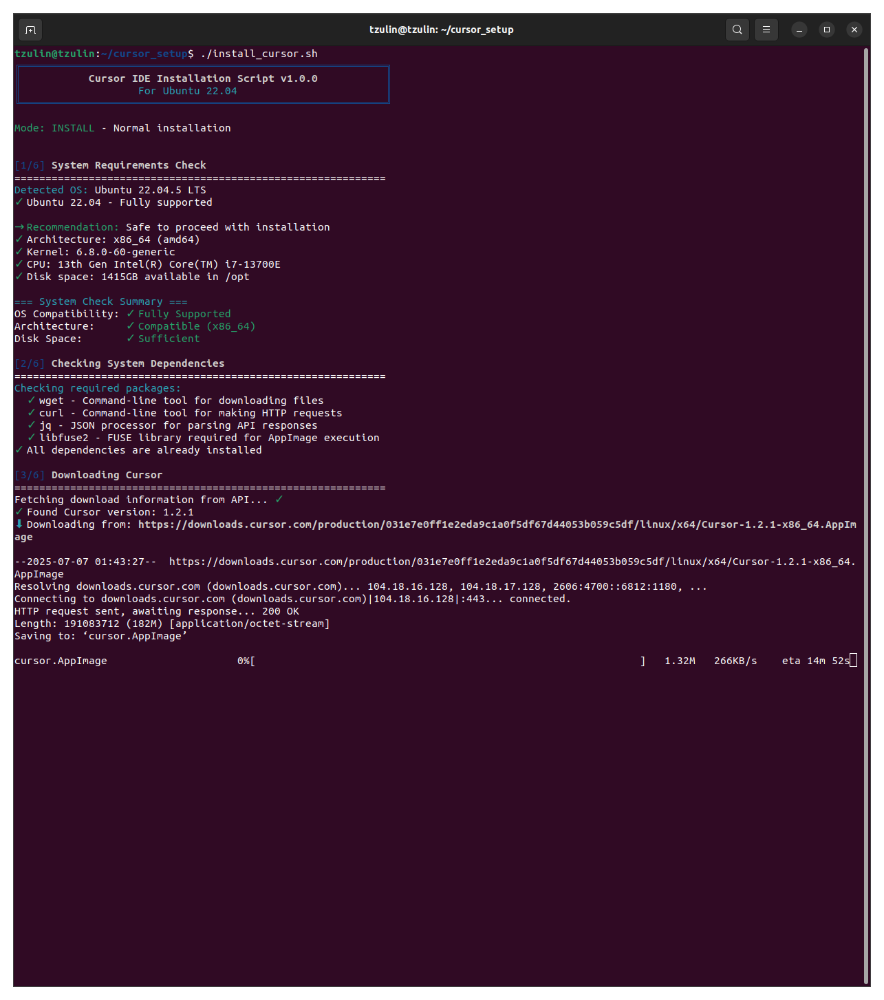
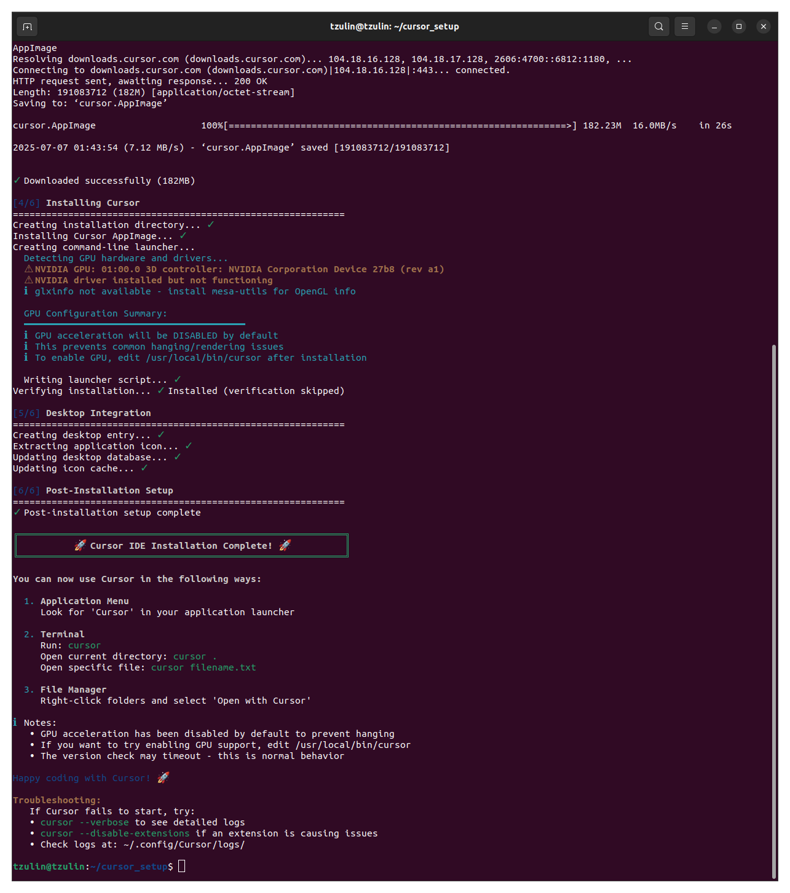

# Cursor IDE Installer for Ubuntu

Automated installation script for [Cursor](https://cursor.com/) - The AI-first code editor.

## 🚀 Quick Start

```bash
git clone https://github.com/tzu-lin-huang/cursor-installer-ubuntu.git
cd cursor-installer-ubuntu
./install_cursor.sh
```

## 📺 Installation Preview

<details>
<summary>Click to see the installation process</summary>

```
╔═══════════════════════════════════════════════════════════╗
║           Cursor IDE Installation Script v1.0.0           ║
║                   For Ubuntu 22.04                        ║
╚═══════════════════════════════════════════════════════════╝

Mode: INSTALL - Normal installation

⚠ Existing Cursor installation detected

Options:
  1. Cancel
  2. Repair (keeps settings, replaces binary)
  3. Reinstall (removes everything, fresh install)
  4. Uninstall (remove Cursor completely)

Choose option (1-4): 3
[sudo] password for user: 

[1/6] System Requirements Check
============================================================
Detected OS: Ubuntu 22.04.5 LTS
✓ Ubuntu 22.04 - Fully supported

→ Recommendation: Safe to proceed with installation
✓ Architecture: x86_64 (amd64)
✓ Kernel: 6.8.0-60-generic
✓ CPU: 13th Gen Intel(R) Core(TM) i7-13700E
✓ Disk space: 1415GB available in /opt

=== System Check Summary ===
OS Compatibility: ✓ Fully Supported
Architecture:     ✓ Compatible (x86_64)
Disk Space:       ✓ Sufficient

[2/6] Checking System Dependencies
============================================================
Checking required packages:
  ✓ wget - Command-line tool for downloading files
  ✓ curl - Command-line tool for making HTTP requests
  ✓ jq - JSON processor for parsing API responses
  ✓ libfuse2 - FUSE library required for AppImage execution
✓ All dependencies are already installed

[3/6] Downloading Cursor
============================================================
Fetching download information from API... ✓
✓ Found Cursor version: 1.2.1
⬇ Downloading from: https://downloads.cursor.com/[...]

[==========================================] 100% 182.23M

✓ Downloaded successfully (182MB)

[4/6] Installing Cursor
============================================================
Creating installation directory... ✓
Installing Cursor AppImage... ✓
Creating command-line launcher... 
  Detecting GPU hardware and drivers...
  ⚠ NVIDIA GPU: 01:00.0 3D controller: NVIDIA Corporation Device 27b8 (rev a1)
  ⚠ NVIDIA driver installed but not functioning
  ℹ glxinfo not available - install mesa-utils for OpenGL info

  GPU Configuration Summary:
  ━━━━━━━━━━━━━━━━━━━━━━━━━━━━━━━━━━━━━━━━━
  ℹ GPU acceleration will be DISABLED by default
  ℹ This prevents common hanging/rendering issues
  ℹ To enable GPU, edit /usr/local/bin/cursor after installation

  Writing launcher script... ✓
Verifying installation... ✓ Installed (verification skipped)

[5/6] Desktop Integration
============================================================
Creating desktop entry... ✓
Extracting application icon... ✓
Updating desktop database... ✓
Updating icon cache... ✓

[6/6] Post-Installation Setup
============================================================
✓ Post-installation setup complete

╔═══════════════════════════════════════════════════════════╗
║          🚀 Cursor IDE Installation Complete! 🚀          ║
╚═══════════════════════════════════════════════════════════╝

You can now use Cursor in the following ways:

  1. Application Menu
     Look for 'Cursor' in your application launcher

  2. Terminal
     Run: cursor
     Open current directory: cursor .
     Open specific file: cursor filename.txt

  3. File Manager
     Right-click folders and select 'Open with Cursor'

ℹ Notes:
   • GPU acceleration has been disabled by default to prevent hanging
   • If you want to try enabling GPU support, edit /usr/local/bin/cursor
   • The version check may timeout - this is normal behavior

Happy coding with Cursor! 🚀

Troubleshooting:
   If Cursor fails to start, try:
   • cursor --verbose to see detailed logs
   • cursor --disable-extensions if an extension is causing issues
   • Check logs at: ~/.config/Cursor/logs/
```

</details>

## 📸 Screenshots

<table>
  <tr>
    <td width="50%">
      
      <p align="center"><em>System checks and downloading</em></p>
    </td>
    <td width="50%">
      
      <p align="center"><em>Ready to use Cursor!</em></p>
    </td>
  </tr>
</table>

### Installation Options

```bash
./install_cursor.sh              # Normal installation
./install_cursor.sh --repair     # Repair broken installation (keeps settings)
./install_cursor.sh --force      # Force reinstall (removes existing)
./install_cursor.sh --uninstall  # Completely remove Cursor
./install_cursor.sh --help       # Show all options
```

## ✨ Features

- **All-in-one script** handles install, repair, reinstall, and uninstall
- **Smart detection** of existing installations with appropriate actions
- **Automatic fallback** to direct download if API is unavailable
- **OS compatibility check** with clear recommendations
- **Comprehensive GPU detection** - identifies NVIDIA/Intel/AMD GPUs and driver status
- **GPU optimization** - disables GPU acceleration by default for maximum stability on Linux
- **Desktop integration** with application menu and file associations
- **System-wide installation** to `/opt/cursor`

## 📋 Requirements

- Ubuntu 22.04 LTS (recommended) or compatible Ubuntu-based system
- x86_64 architecture
- sudo access
- 2GB+ free space

## 📚 Documentation

- [Manual Installation Guide](docs/manual-installation.md) - Step-by-step manual installation
- [GPU Troubleshooting](docs/gpu-troubleshooting.md) - Fixes for GPU/VSync errors

## 🛠️ What Gets Installed

- **Cursor IDE**: `/opt/cursor/cursor.AppImage`
- **Command**: `/usr/local/bin/cursor`
- **Dependencies**: `wget`, `curl`, `jq`, `libfuse2` (if missing)

## 💡 Usage

After installation:

```bash
cursor              # Launch Cursor
cursor .            # Open current directory
cursor file.txt     # Open specific file
```

Or use the application menu to launch Cursor.

## 🐛 Troubleshooting

### Common Issues

**Cursor hangs on startup?**
- GPU acceleration is disabled by default to prevent hanging (common issue with Electron apps on Linux)
- If you still experience issues, try: `cursor --verbose` to see detailed logs

**GPU/VSync Errors?** 
- GPU acceleration is disabled by default for stability (best practice for Electron apps on Linux)
- The installer automatically detects:
  - **GPU Hardware**: NVIDIA, Intel, AMD graphics cards via `lspci`
  - **Driver Status**: 
    - NVIDIA: Checks `nvidia-smi` functionality and driver version
    - Intel: Verifies `i915` kernel module is loaded
    - AMD: Checks for `amdgpu` or `radeon` kernel modules
  - **OpenGL Support**: Tests hardware acceleration capability via `glxinfo`
  - **VSync Issues**: Applies workarounds (`vblank_mode=0` and `__GL_SYNC_TO_VBLANK=0`)
- To enable GPU acceleration:
  1. Edit `/usr/local/bin/cursor`
  2. Remove the `--disable-gpu` flag
  3. Optionally add: `--use-gl=desktop --enable-gpu-rasterization`
- For advanced GPU troubleshooting, see [GPU Troubleshooting](docs/gpu-troubleshooting.md)

**Version check times out?**
- This is normal behavior for the AppImage format
- The actual version is 1.2.1 (as of this installer)

**Icon missing in application menu?**
- The installer attempts multiple methods to extract the icon:
  1. Direct icon extraction from AppImage
  2. Full AppImage extraction with timeout
  3. Downloading from online sources as fallback
- Icon cache is automatically updated after installation
- This is cosmetic and doesn't affect functionality

**Installation Failed?** 
- Check that you have sudo access
- Ensure you have at least 2GB free space in `/opt`
- Try the [Manual Installation Guide](docs/manual-installation.md)

---

**Note**: This is an unofficial installer for Cursor IDE. Cursor is subject to its own [Terms of Service](https://cursor.com/terms-of-service) and [Privacy Policy](https://cursor.com/privacy). By using this installer, you agree to Cursor's terms.